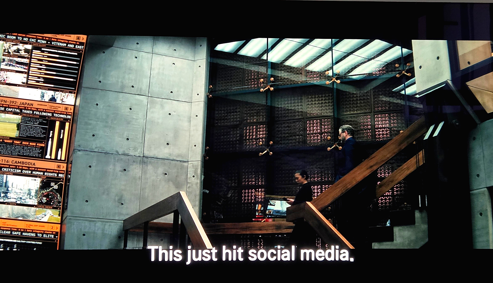
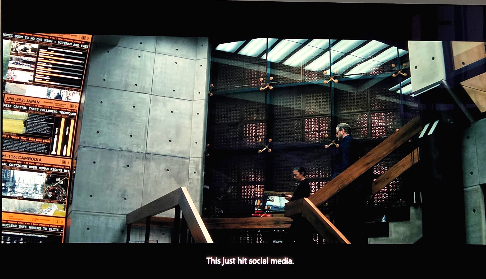
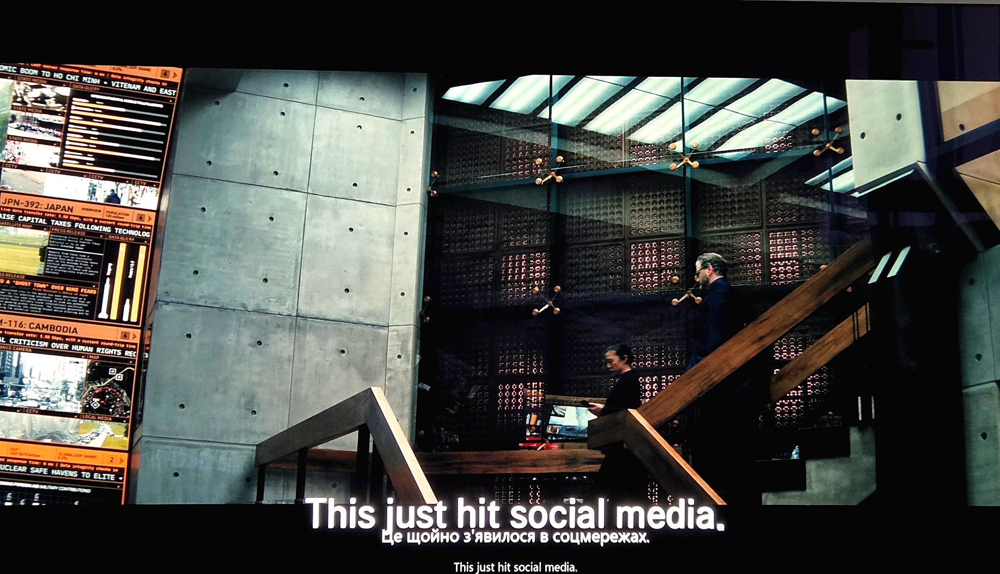
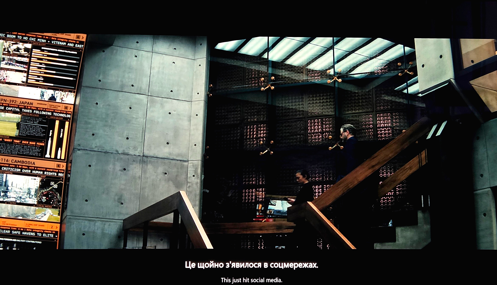
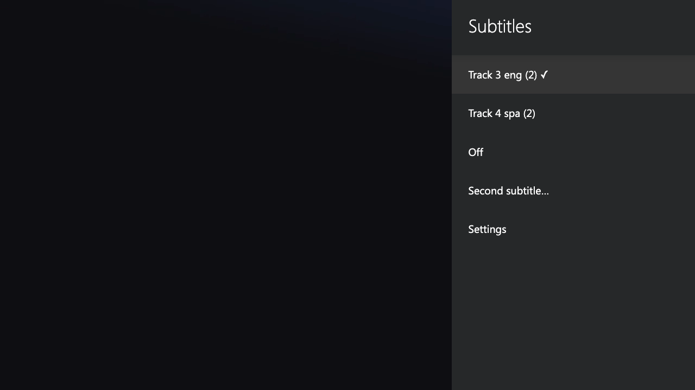
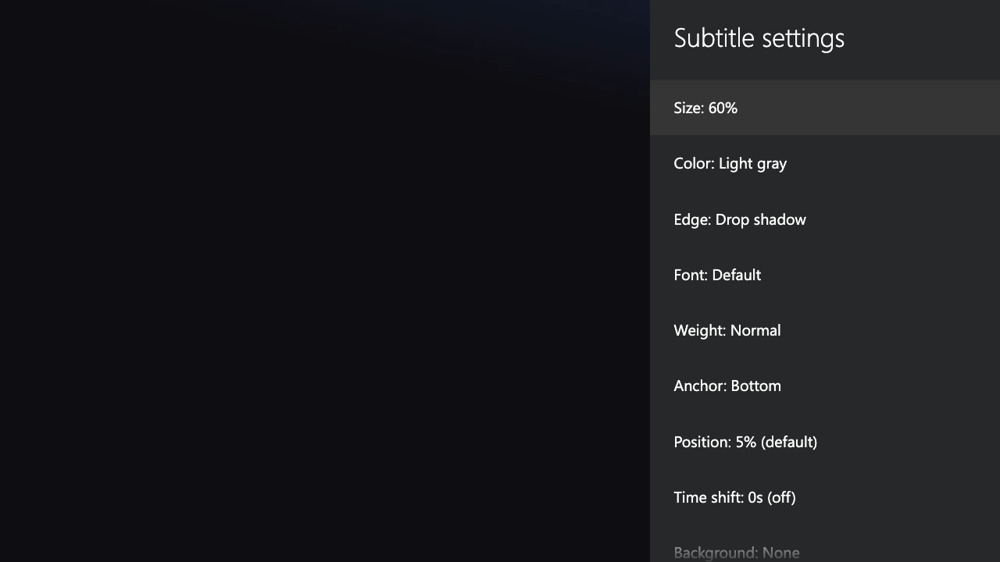

> Embedded subtitles for [Lampa](https://github.com/yumata/lampa) on Smart TVs. One file, zero dependencies.

[](LICENSE)
[]()
[]()

webOS renders embedded subtitles with a fixed, oversized style that apps cannot change: no size, no position, no color. This plugin replaces them. It extracts the subtitle tracks directly from the stream (MKV and MP4) and renders them as its own overlay, fully under your control.

## Why

Developed and tested on an LG webOS TV. When webOS renders subtitles natively (the luna pipeline), the result is hideous: enormous text by default, sized as if LG assumes its users are legally blind, with **zero** app-side control. No size, no position, no color; the appearance API politely returns `returnValue: true` and changes nothing. The only knob LG gives you is buried in the TV's own accessibility menu, and it barely helps.

This plugin bypasses that entirely: subtitles are extracted from the stream and drawn by the plugin itself, so every aspect (size, position, color, outline, background, even two tracks at once) is yours to control.

## Features

- 🎬 **MKV**: SRT/ASS tracks via seek-index extraction. Reads only stream regions near the playhead, handles multi-GB 4K remuxes
- 📦 **MP4**: mov_text/tx3g tracks via a moov sample-table parser. Fetches *only* subtitle bytes, near-zero bandwidth
- 🌍 **Dual subtitles**: two tracks simultaneously (watch with mixed-language viewers), each styled independently
- 🎨 **Per-track styling**: size, 21 colors, edge/outline, font, weight, background, top/bottom anchor, vertical position
- ⏱️ **Time shift**: ±10 s per track
- 💾 **Remembers your choice**: track selection persisted per stream, sensible auto-pick otherwise
- ⚡ **Seek-friendly**: subs appear within ~1 s after jumping anywhere in the file
- 🔧 **Tunable**: region size (RAM) and lookahead (bandwidth) knobs for weaker TVs

## Screenshots

Same frame on an LG webOS TV, before and after.

**Before** — native webOS subtitles (fixed, huge, unstylable):



**After** — the plugin (60% size, light gray, drop shadow):



All three at once for scale: native luna on top, plugin's Ukrainian track under it, plugin's English track below:



Two subtitle tracks simultaneously (Ukrainian + English), each styled independently:



Track picker on the player panel, and per-track settings:

| Picker | Settings |
|--------|----------|
|  |  |

## Install

In Lampa go to **Settings → Extensions → Add Plugin** and paste:

```
https://adambenhassen.github.io/subs.js
```

Restart Lampa after adding. No rebuild, no server-side changes. Works with any HTTP stream source out of the box.

## Usage

1. Start playback of an MKV or MP4 stream with embedded text subtitles.
2. Press the **subtitles button** on the player panel.
3. Pick a track, or open **Second subtitle…** for a simultaneous second language, and **Settings** for styling.

| Menu | What it controls |
|------|-----------------|
| Track list | Which embedded track renders (choice saved per stream) |
| Second subtitle… | Optional second track + its own settings |
| Settings | Size, color, edge, font, weight, anchor, position, time shift, background |
| Settings → Region size / Lookahead | RAM vs. subtitle-readiness trade-off |
| Settings → Debug panels | On-screen extraction diagnostics |

## How it works

- **MKV**: parses the header + Cues seek index, then streams ~12 MB cluster regions around the playhead through a bundled [matroska-subtitles](https://github.com/mathiasvr/matroska-subtitles) demuxer. Exact time-to-byte mapping, no full-file download.
- **MP4**: walks the `moov` box, reads the subtitle tracks' sample tables (`stts`/`stsz`/`stsc`/`stco`), then issues tiny ranged GETs for just the subtitle samples ahead of the playhead.
- Rendering is a positioned DOM overlay above the native `<video>` plane. Survives hardware-accelerated playback where canvas approaches fail.

## Compatibility

| Environment | Status |
|-------------|--------|
| LG webOS (Chrome 120 runtime) | ✅ Tested |
| Desktop browser Lampa | ✅ Expected to work (standard DOM/fetch APIs) |
| PGS / VOBSUB (bitmap subs) | ❌ Not supported (text tracks only) |

Requires the stream host to support HTTP Range requests.

## Troubleshooting

- **No tracks listed**: the file may have only bitmap (PGS) subs, or the host ignores Range requests. Enable *Debug panels* to see extraction status.
- **Subs lag right after a far seek**: the stream data hasn't arrived yet; they catch up with the video buffer.
- **App restarts on low-RAM TVs**: lower *Region size* in Settings.

## License

[MIT](LICENSE). Bundles [matroska-subtitles](https://github.com/mathiasvr/matroska-subtitles) (MIT, © Mathias Rasmussen), see [`LICENSE-matroska-subtitles`](LICENSE-matroska-subtitles).
